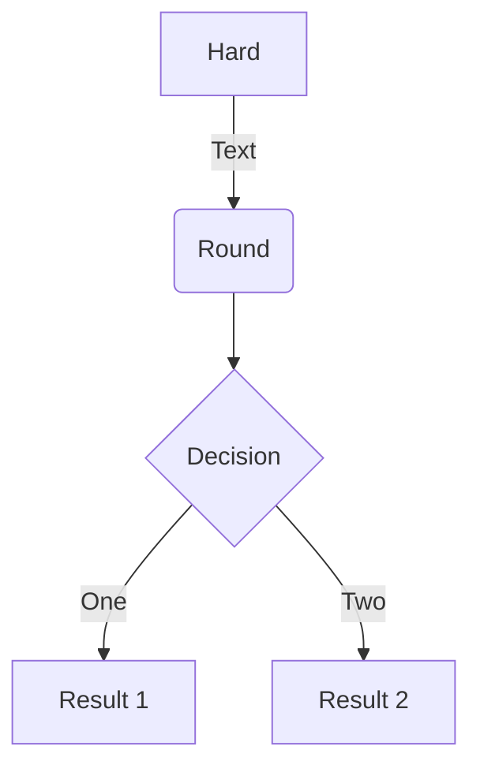

## 💥 Breaking Changes

- Refactor sub-menu ([#492](https://github.com/next-theme/hexo-theme-next/pull/492))

## ⭐ Features

- Support mermaid inside backtick code block ([a396c61](https://github.com/next-theme/hexo-theme-next/commit/a396c61a0ad66d6e32bb59c23482987547199add))
~~~markdown

~~~

## 🐞 Bug Fixes

- Fix Microsoft Clarity Analytics ([#480](https://github.com/next-theme/hexo-theme-next/pull/480))
- Fix tabs style issue ([32892a6](https://github.com/next-theme/hexo-theme-next/commit/32892a688ef761925adbd0fcbe25aa465f45fdcd))
- Support linebreaks inside `a` and `img` elements ([edf3675](https://github.com/next-theme/hexo-theme-next/commit/edf3675f32e9bd33b5613e48d3d11bd56cdb5f0e))

## 🛠 Improvements

- Fix Mist style with sub menu ([#479](https://github.com/next-theme/hexo-theme-next/pull/479))
- Fix site-nav style issue ([72c28e5](https://github.com/next-theme/hexo-theme-next/commit/72c28e5e87a015abde1c1fbca5fcf31b6c8112a4))

## 🌀 External Changes

- Update actions/labeler action to v4 ([#478](https://github.com/next-theme/hexo-theme-next/pull/478))
- Update actions/checkout action to v3 ([#476](https://github.com/next-theme/hexo-theme-next/pull/476))
- Update dependency eslint to v8.12.0 ([#488](https://github.com/next-theme/hexo-theme-next/pull/488))
- Update dependency mocha to v9.2.2 ([#487](https://github.com/next-theme/hexo-theme-next/pull/487))
- Update dependency hexo to v6.1.0 ([#486](https://github.com/next-theme/hexo-theme-next/pull/486))
- Update availability of pjax & local_search in vendors ([#496](https://github.com/next-theme/hexo-theme-next/pull/496))

## 🌍 Localization

- New Crowdin updates ([#483](https://github.com/next-theme/hexo-theme-next/pull/483))

***

For full changes, see the [comparison between v8.10.1 and v8.11.0](https://github.com/next-theme/hexo-theme-next/compare/v8.10.1...v8.11.0)

[Detailed changes for NexT v8.11.0](https://github.com/next-theme/hexo-theme-next/releases/tag/v8.11.0)
